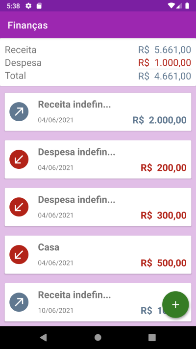
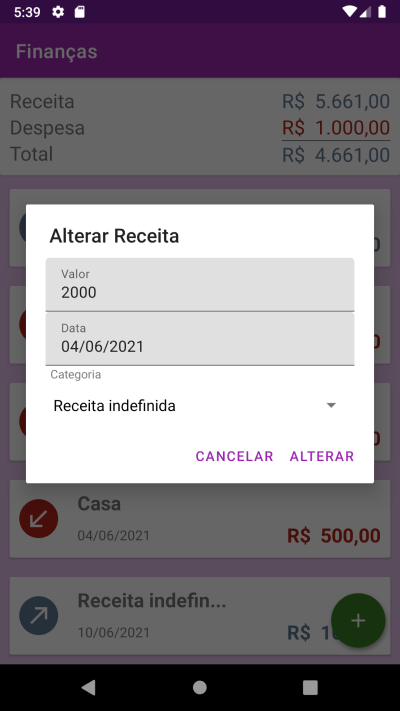

# App Finanças by chicorasia

App de finanças pessoais desenvolvido no [curso de desenvolvimento Android com Kotlin](https://www.alura.com.br/curso-online-android-com-kotlin-parte-1).
Tecnologias empregadas:
- Viewbinding
- Persistência local com Room
- Coroutines

****

:computer: chicorialabs.com.br/blog
